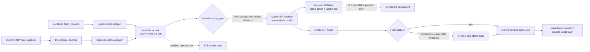

# Evelyn Korean ASR Target Architecture

Last updated: 2026-08-24
Status: core session/local path implemented in source and tests; live rollout and later phases pending
Scope: Local Voice and Discord voice audio from capture through authoritative final transcript

## 1. Purpose

This document defines a Korean-first ASR target for Evelyn. It is not a description of current
runtime behavior. The target is to reduce repeated inference and end-of-utterance latency without
weakening Evelyn's existing wake, owner, consent, replay, or high-impact action boundaries.

The shortest useful design is:

```text
one surface-specific audio adapter
-> one ephemeral ASR stream
-> many non-authoritative revisions
-> one authoritative final transcript
-> the existing surface-specific admission gate
```

No new message broker, database, ASR ensemble, or automatic cloud fallback is required.

## Implementation checkpoint (2026-08-24)

Implemented and covered by offline source tests:

- A Bot API-owned durable voice-input lease permits either `local_mic` or `discord_voice`, never
  both. Local capture acquires before its ON request and releases only after an exact physical-stop
  ACK. Discord acquires before `listen()` and releases only after its receive/decrypt/utterance tasks
  stop; move/rearm retains a process-wide ref-counted lease.
- The existing STT service now owns one `Qwen3ASRModel.LLM` vLLM model, bounded ephemeral
  `start/chunk/finish/cancel` sessions, raw 16 kHz PCM16 transport, monotonic sequence fences, a
  30-second cap, a 60-second TTL, and one inference lock. The legacy batch endpoint remains.
- Local Voice emits capture-time 16 kHz PCM16 chunks of at most 500 ms, adopts only a consistent
  non-empty final, and performs at most one legacy batch fallback.
- Discord's completed 16 kHz PCM is sent to the resident model's batch endpoint exactly once. A
  valid non-empty result is reused for wake and final STT, replacing the normal duplicate
  wake/partial/full/rescore calls. Damaged transport retains the stricter independent wake
  confirmation path. Session streaming remains Local capture-time only.
- Stateful partials remain non-authoritative, final admission remains surface-owned, and ordinary
  STT/wake/final logs contain lengths and fixed reason codes instead of transcript text.
- Client-side batch STT serialization follows the physical blocking worker lifetime. Caller timeout
  or repeated cancellation does not release the shared inference lock until the already-started thread
  actually returns; the cancellation-resistant drain consumes its result and releases the lock. Streaming
  startup and Local Bridge transitions likewise keep their exact cleanup owner until the physical child
  finishes. A permanently stuck physical client therefore fails closed on availability, and the live
  network/GPU fault remains unverified.

Still pending:

- Building and loading the revised STT image on the live GPU stack, plus latency, quality, VRAM, and
  contention measurement.
- Packet-time Discord Opus decode. Discord therefore does not yet expose capture-time partials; its
  completed utterance currently uses one offline/batch decode after the existing endpoint detector.
- Korean KWS, output-reference AEC, partial-driven prefetch, and optional bounded context.

## 2. Verified pre-change baseline

At design time, Local Voice and Discord voice did not share one ingress pipeline. This baseline is
kept to explain the migration; the implementation checkpoint above is the newer source state.

| Surface | Verified current behavior |
| --- | --- |
| Local Voice | Windows `LocalIoBridge` collects a complete segment, performs one whole-audio STT request, then uses the durable Local Voice admission manager. |
| Discord | RTP/Opus packets are buffered until about 0.82 seconds of silence, decoded after the utterance ends, then passed through wake probe, partial, full, optional rescore, finalization, and Discord session gates. |
| Shared STT service | `Qwen/Qwen3-ASR-1.7B` is resident behind one stateless base64 JSON endpoint, `POST /v1/stt/transcribe`. The current backend is Transformers `from_pretrained`, not the official vLLM streaming backend. |

Important consequences:

- Discord wake probing can call the same ASR twice on the first 1.4/1.6 seconds.
- Discord `partial` runs only after the utterance is complete and retranscribes a short tail window;
  it is not live streaming.
- Discord then performs a full pass and, when enabled, a second whole-audio pass. A normal turn can
  therefore reach five serial calls to the same model.
- The request includes `max_new_tokens`, but `stt_service.py` does not pass that value to
  `model.transcribe()`. The current extra-token rescore is therefore not a distinct decoding mode.
- Local Voice has no partial or rescore path; it is `segment -> one final STT -> admission`.
- Normal non-validation paths can currently print transcript text. The target telemetry boundary
  below closes that privacy gap rather than expanding it.

Current evidence owners:

- `evelyn_core/runtime/evelyn_core/stt_service.py`
- `evelyn_core/runtime/evelyn_core/stt_client.py`
- `evelyn_core/runtime/evelyn_core/stt_text_runtime.py`
- `evelyn_core/runtime/evelyn_core/voice_stt_execution_runtime.py`
- `evelyn_core/runtime/evelyn_core/voice_stt_flow.py`
- `evelyn_core/runtime/evelyn_core/voice_member_audio_pipeline_runtime.py`
- `evelyn_core/runtime/evelyn_core/local_io_bridge.py`
- `evelyn_core/runtime/evelyn_core/local_voice_admission.py`
- `evelyn_voice/client.py`
- `docs/LOCAL_VOICE_ADMISSION_CONTRACT.md`
- `docs/VOICE_CAPTURE_CONSENT.md`

No live microphone, Discord, Docker image, or concurrent-GPU measurement was performed for this
implementation checkpoint.

## 3. Non-negotiable rules

1. A KWS result is only permission to start or retain ASR work. It is never permission to execute a
   command.
2. A partial transcript may update UI or start cancelable prefetch. It may not enter history,
   memory, tools, world actions, or durable admission.
3. Only the final transcript may enter the existing Local or Discord admission path.
4. Initial admission continues to require the exact normalized leading `이블린`. The existing
   45-second follow-up behavior remains, and high-impact intents still require a fresh wake.
5. Local Voice capture-consent, bridge-instance, generation, owner, and replay fences remain outside
   the ASR service and must be current when a final is adopted.
6. Raw PCM and transcript revisions are session-RAM data. They are released at final, cancel, cap,
   or timeout and are not written to project documentation or ordinary runtime logs.
7. Local ASR is the default. A failed local ASR turn must not silently upload audio to a cloud
   provider.

## 4. Target pipeline



The Local and Discord adapters share the ASR protocol and transcript contracts, but they do not
merge their authorization implementations. Local durable admission and Discord room/session policy
remain separate owners.

## 5. Audio ingress

### 5.0 One physical input owner

The Bot API is the single arbiter for physical voice input. It persists only opaque source/instance/
lease identifiers under `runtime_artifacts/voice_input_lease/`; it does not store audio or
transcripts. An input must acquire before capture starts and keeps ownership across all transition
windows. Local releases only after the matching OFF revision/action reports `applied` and physical
capture stopped. Discord releases only after listener tasks terminate, with a process-wide refcount
covering channel move/rearm. Missing auth, stale/unknown ownership, persistence failure, or a
conflicting source fails closed. This capture lease does not replace either surface's admission gate.

### 5.1 Canonical frame

The ASR boundary accepts 16 kHz, mono, signed 16-bit PCM. Capture adapters own conversion before the
network boundary.

```text
AudioFrame
  pcm16: bytes
  duration_ms: 20..500
  capture_sequence: monotonically increasing integer
  end_of_stream: boolean
```

The ASR service does not need a user name, guild id, raw bridge id, transcript history, or memory
context. The caller binds the returned stream id to its existing local `TurnScope`, capture
generation, consent fence, or Discord channel generation.

### 5.2 Local adapter

Add optional `on_speech_start` and `on_audio_chunk` seams after
`LocalMicCaptureService._consume_block()`. Keep the current complete `on_segment` callback until the
streaming path has passed shadow comparison and as the batch fallback.

The streaming adapter should send canonical 16 kHz mono directly. It should not convert to 48 kHz
stereo for Discord compatibility and then resample back to 16 kHz for STT.

### 5.3 Discord adapter

The current completed-utterance callback is too late for streaming. Add packet-time incremental
Opus decode and a chunk callback before the 0.82-second utterance flush. Keep the current completed
PCM callback as the fallback source.

Do not reduce the silence constant first. That can trade latency for truncated Korean endings. Run
the new endpoint detector in shadow and compare its boundary against the current utterance.

### 5.4 Front-end and barge-in

- VAD, resampling, a bounded pre-roll ring, and any AEC run before GPU ASR.
- Local AEC is valid only when it consumes the exact TTS playback reference. Without verified AEC,
  owner speech during Evelyn's playback may interrupt early only under the existing owner/speaker
  policy; non-owner or uncertain speech degrades to wake-qualified interruption.
- `speech_start` may request TTS cancellation. It does not create a user turn. Capture continues
  until finalization, and the final transcript still passes admission.
- Existing playback-generation and released-tail fences remain authoritative during migration.

## 6. Wake path

The target dormant path is CPU VAD plus a small Korean wake-word detector and a 1.5-second RAM
pre-roll. Its output is a `WakeCandidate`, not `wake_detected=true` for admission.

```text
WakeCandidate
  detected: boolean
  score_bucket: low | medium | high
  audio_begin_ms: integer
  audio_end_ms: integer
  model_revision: opaque non-user identifier
```

The candidate vocabulary may cover acoustic variants such as `이블린` and `이블린아`, but that does
not expand the accepted command syntax. The final transcript must still satisfy the existing exact
leading-wake contract unless a current follow-up or validation capability applies.

No off-the-shelf KWS runtime is selected by this blueprint. As of this design date, openWakeWord's
official documentation describes English as its supported language, while sherpa-onnx's published
KWS checkpoints are Chinese/English. A Korean custom candidate must therefore pass shadow data
before becoming a gate. Until then, retain the current short ASR wake probe as the feature-flagged
fallback; never fall back to accepting all speech.

## 7. Stateful STT service

### 7.1 One service and one model

Extend the existing `stt` FastAPI service rather than adding another gateway or model server.

- Replace the Transformers-only loader with one resident `Qwen3ASRModel.LLM` instance.
- Use its vLLM-only streaming state for partial/final recognition.
- Use the same instance's offline `transcribe()` only for the legacy endpoint or one conditional
  final retry.
- Keep `POST /v1/stt/transcribe` during migration and as the bounded batch fallback.
- Do not load both the 0.6B and 1.7B models unless measured data later proves one model cannot meet
  the quality and latency gates.

Qwen's public streaming result exposes the evolving `state.text`, not a confidence, n-best list, or
explicit stable-prefix boundary. Evelyn must not invent a confidence value.

### 7.2 Minimal session API

The current standard-library HTTP client can support a session protocol without adding a WebSocket
or gRPC dependency.

```text
POST   /v1/stt/streams
POST   /v1/stt/streams/{stream_id}/chunks
POST   /v1/stt/streams/{stream_id}/finish
DELETE /v1/stt/streams/{stream_id}
```

`POST /streams` accepts only:

```json
{
  "sampling_rate": 16000,
  "language": "Korean",
  "decoder_profile": "realtime-ko",
  "context_terms": []
}
```

The chunk body is raw `application/octet-stream` PCM16 with a monotonic sequence header. The server
rejects missing, duplicate, or out-of-order chunks, owns a short session TTL and the existing
30-second audio cap, and frees all state on finish, cancel, cap, or TTL expiry.
The service remains reachable only through the current loopback/internal Docker boundary; the
session routes are not public APIs.

Each chunk response is small:

```json
{
  "revision": 4,
  "text": "이블린 오늘 날씨",
  "isFinal": false
}
```

This text is returned to the authorized caller but never printed by the server.

### 7.3 Decode cadence and compute boundary

Start shadow tuning with 500 ms transport pushes and either the official 2-second decoder cadence or
a measured 1-second cadence. Do not promise sub-300 ms partials: the Qwen streaming wrapper gathers
audio and reprocesses accumulated audio at each decode rather than exposing a reusable acoustic
cache. Longer utterances therefore cost progressively more.

The initial tuning candidates are configuration, not product contracts:

- `chunk_size_sec`: 2.0 baseline, 1.0 experiment
- `unfixed_chunk_num`: official baseline first; tune only with paired Korean revisions
- `unfixed_token_num`: 5 baseline
- utterance cap: 30 seconds

The server serializes model calls behind a bounded inference lock. When overloaded, it drops
intermediate partial work before delaying `finish`; finalization has higher priority than shadow,
partial, or optional rescore work.

### 7.4 Dependency and GPU gate

Official Qwen streaming currently requires the vLLM extra. The source image has been migrated to the
Qwen-supported `vllm==0.14.0` and PyTorch/Torchaudio 2.9.1 CUDA 12.8 combination. That image has not
yet been built or smoke-tested, so compatibility and GPU readiness remain rollout gates rather than
verified runtime state.

Keep ASR on the current configured GPU initially and reduce inference count before moving workloads.
Set vLLM memory utilization from measured full-stack headroom, not its high demo default. A move to
the second GPU or a global GPU scheduler is justified only by concurrent Main LLM, TTS, and ASR p95
evidence. No such live evidence exists yet.

## 8. Partial stabilization

Qwen retains an unfixed tail internally but does not return a public fixed-prefix boundary. Evelyn's
revision stabilizer therefore owns one monotonic committed prefix.

Rules:

1. Revision 1 is entirely volatile.
2. From revision 2 onward, compute the longest common prefix of consecutive revisions.
3. Commit only through the previous Korean spacing boundary; retain the last word as volatile. If no
   safe boundary exists, use a small character holdback.
4. A committed prefix can grow but never shrink.
5. If the final conflicts with a committed prefix, cancel speculative work and invoke the ambiguity
   policy; do not silently splice the strings.

```text
AsrRevision
  revision: integer
  stable_prefix: string
  volatile_suffix: string
  final: boolean
```

The current `TranscriptResult(partial, committed, final)` shape can remain. Only its producer changes
from an after-the-fact tail pass to actual session revisions.

## 9. Final, correction, and rescore policy

### 9.1 Authoritative final

`finish_streaming_transcribe()` is the default final. It is sent through the existing deterministic
cleanup/correction code and then into the existing Local or Discord admission implementation.

The first implementation disables the current default whole-audio rescore. A second offline pass is
allowed at most once only when there is observable ambiguity:

- voiced audio produced an empty or structurally broken final;
- the final is repetitive-noise shaped;
- a strong wake candidate produced a near-miss leading wake;
- the final conflicts with an already committed stable prefix;
- the streaming backend failed to flush its tail.

The second pass must never upgrade a near-miss into admission unless its own final text satisfies the
exact wake rule. Candidate selection must not prefer the longer string. If two finals disagree about
wake, a high-impact intent, or a critical entity, the turn is dropped or clarified with zero side
effects.

### 9.2 Context and Korean domain terms

Qwen `context` is free text inserted into its system prompt. It is not a weighted phrase set and it
does not expose per-term confidence. Keep it disabled in the first streaming rollout.

If paired evaluation later proves a benefit, enable only a short server-built allowlist:

- fixed wake/product terms;
- currently enabled tool surface names;
- bounded active Minecraft item/entity names;
- at most 24 terms and 160 characters, fixed when the stream starts.

Never copy conversation history, memory, user text, contacts, or arbitrary proper names into this
field. Do not log the terms; log only an allowlist version and term count.

Keep existing explicit confusion maps for known Korean/Konglish aliases. Do not add an LLM rewrite
between ASR and admission, and do not perform blind global string replacement on the wake word or
high-impact command terms.

## 10. Session state and authority

```text
DORMANT
  -> CANDIDATE        CPU KWS candidate, or existing wake-probe fallback
  -> STREAMING        current follow-up/validation may enter directly
STREAMING
  -> FINALIZING       endpoint or utterance cap
  -> CANCELLED        owner/generation/consent/source binding changed
FINALIZING
  -> ADMISSION        authoritative final exists
  -> CANCELLED        final/fallback failed
ADMISSION
  -> DONE             existing surface gate accepted or rejected the turn
```

Every callback rechecks its caller-owned binding before using a revision or final. A stale final is
discarded even if transcription succeeded. Closing an ASR session never revives an expired Local
capability, Discord owner, old channel generation, or cancelled TTS generation.

### 10.1 Local soft endpoint and reopen target

This subsection is an approved target, not current runtime behavior. The current personal Local
Bridge still uses a 500 ms hard endpoint and has no general reopen/merge path. Discord and qualified
barge-in are unchanged by this design.

`LOCAL_MIC_SOFT_REOPEN_ENABLED=false` is the rollout gate. While it is false, the two new threshold
settings are ignored and `LOCAL_MIC_MAX_SILENCE_MS=500` remains the sole hard endpoint. Enabling the
gate also requires `LOCAL_BRIDGE_STT_STREAMING_ENABLED=true`; otherwise status reports
`soft_reopen_requires_streaming` and the current hard path remains active.

```text
STREAMING
  -> SOFT_PENDING     300 ms after the last voiced sample
SOFT_PENDING
  -> STREAMING        speech resumes within the additional 500 ms grace
  -> HARD_COMMIT      grace expires with no resumed speech
  -> CANCELLED        owner, generation, admission, validation, or process fence changes
HARD_COMMIT
  -> PROMOTE          authoritative final and prepared draft bindings match exactly
  -> ORDINARY_PATH    no draft, mismatch, expiry, or uncertain state
```

At `SOFT_PENDING`, flush only pending PCM into the existing ASR stream. Keep the capture generation,
complete PCM, and ASR session alive. A resumed voiced block returns the same generation to
`STREAMING`; after its next 300 ms pause it creates a successor soft epoch over all PCM received so
far. Never finish and reopen the ASR session, concatenate transcript strings, or create a second turn.
With no resume, the configured hard commit is 300 ms + 500 ms, subject only to capture scheduling.
The utterance cap and an explicit capture stop remain immediate terminal boundaries.

The latency overlap requires one ephemeral `prepare -> promote/abort` transaction per Local capture:

- `prepare` may read an immutable context snapshot, finish a conversational model draft, and stage
  only the first non-empty TTS PCM chunk, capped at 256 KiB, in process memory. It may not consume
  admission, claim durable ingress, append
  history/archive/memory, invoke tools/actions, make external effects, or write to the audio device.
- The opaque draft is bound to bridge instance, admission epoch, capture generation, soft epoch,
  validation binding, authoritative input digest, context revision, and model/TTS identity. Ordinary
  logs expose none of these raw identifiers, text, prompts, or audio.
- Resume marks the draft stale and aborts it. A late prepare result must be drained and discarded.
  Repeated pause/resume creates only a successor soft epoch; at most one current draft exists.
- Hard commit first obtains the authoritative ASR final. Promotion is allowed only when every binding
  and the normalized input digest match. Promotion atomically performs the existing admission and
  durable accepted-user ingress claim once, then releases staged playback. The existing Local
  authenticated playback ACK contract remains authoritative: only a successful exact ACK may append
  assistant history/continuity and start background work; failed, partial, or cancelled playback
  preserves the accepted user-only turn. A mismatch, expiry, tool/memory/action route, an oversized
  first PCM chunk, or uncertain cancellation aborts the draft and uses the ordinary post-endpoint path.
- Restart, mic OFF, queue drop, validation loss, or admission epoch change discards the in-memory
  draft and current ASR session. No draft is durable or recoverable.

Any capture whose private context contains `_bargeSource` bypasses this state machine and retains the
existing qualified barge-in capture, admission, and playback-interruption path.

Content-free metrics add soft endpoint, reopen, hard commit, prepare, abort reason, promotion, and
last-voice-to-first-verified-PCM durations. They never contain transcript, PCM, prompt, or raw owner
identifiers. The initial warm target is p95 <= 350 ms to soft endpoint and p95 < 1,000 ms from the last
voiced sample to verified first PCM, with duplicate admission/history/memory/tool/action/playback at
zero. These are release gates, not current measurements.

## 11. Failure policy

| Failure | Required behavior |
| --- | --- |
| KWS unavailable | Use the existing ASR wake probe behind a feature flag. Never open admission to all speech. |
| Partial timeout or overload | Stop emitting partials and continue toward final; do not fail the turn solely because UI text is late. |
| Stream session failure | Use the caller's still-ephemeral complete utterance for one legacy batch final. |
| Final and fallback both fail | Return a fixed failure reason, release audio, and perform no tool/LLM side effect. |
| Context rejected | Continue or restart before meaningful decode without context; do not duplicate a completed turn. |
| Process restart | Streaming state is not recoverable. Batch fallback is allowed only if the current caller still owns the buffered utterance and all fences remain current. |
| GPU pressure | Prioritize final over partial, shadow, and rescore; reject excess sessions with a fixed retryable code. |
| Cloud unavailable | No effect, because cloud is not an automatic fallback. |

An optional cloud recognizer is a later product choice requiring explicit per-utterance consent. If
introduced, it receives only the command utterance, not wake pre-roll, history, memory, internal ids,
or admission tokens. It remains disabled by default.

## 12. Privacy-safe observability

Ordinary metrics may contain:

- source class: `local` or `discord`;
- audio duration, chunk count, revision count, and committed character count;
- wake score bucket and fixed reason code;
- VAD, first-partial, endpoint, final, fallback, and total latency;
- queue wait, model revision, fallback-used boolean, and cancellation reason;
- context allowlist version and count.

Ordinary logs, health, Control Page status, traces, and worklogs must not contain:

- raw or encoded PCM, file paths, or debug-audio locations;
- partial, final, wake, or fallback transcript text;
- context terms, prompts, memory, or user/guild/channel names;
- raw stream, admission, bridge, validation, or consent identifiers.

Debug audio or transcript capture is a separate, explicit, time-limited diagnostic consent mode with
automatic deletion. It is never stored under `docs/`.

## 13. Initial performance and quality gates

These are proposed release gates, not current measurements.

| Measure | Initial gate |
| --- | --- |
| Wake-end to KWS candidate | p95 <= 250 ms |
| Speech-start to first partial, official 2 s cadence | p95 <= 2.5 s |
| Speech-start to first partial, validated 1 s cadence | p95 <= 1.5 s |
| Last voiced sample to endpoint | local p95 <= 500 ms; Discord p95 <= 700 ms |
| Endpoint to final without offline retry | local p95 <= 900 ms; Discord p95 <= 1.2 s |
| Qualified barge-in to TTS stop | local p95 <= 200 ms; Discord p95 <= 300 ms |
| Optional offline retry rate | <= 20% of ordinary accepted speech |
| Truncation | <= 1% of paired utterances |
| Stable-prefix rollback | 0 |
| Raw audio/transcript leakage in ordinary outputs | 0 |
| Unauthorized high-impact action in negative suite | 0 |

KWS enforcement additionally requires at least 200 consented positive utterances and 10 hours of
ambient, music, TTS, and near-miss negatives, with local false rejection <= 5%, Discord false
rejection <= 10%, and false candidates <= 0.1/hour. These samples are private evaluation artifacts,
not documentation content.

The paired Korean ASR corpus must cover:

- clean, far-field, fan/keyboard noise, and TTS barge-in;
- Discord Opus, packet gaps, multiple speakers, and channel-generation cancellation;
- `이블린` at the exact lead, mid-sentence near-misses, follow-up, and high-impact fresh-wake cases;
- Korean spacing, numbers, English/Korean code switching, Minecraft entities/items, and tool names;
- silence, music, repeated syllables, and hallucination-prone short clips.

Ship only when normalized Korean CER is no worse than the current Qwen baseline, domain-entity exact
match is at least 95%, and concurrent Main LLM + TTS + ASR testing produces no OOM or final-latency
regression beyond the gates.

## 14. Minimal rollout

### Phase 0. Remove known waste and establish evidence

- Add content-free stage timers and paired offline scoring.
- Stop logging raw transcripts in ordinary paths.
- Disable the current default duplicate rescore after a narrow regression check.
- Record current Local and Discord latency/quality separately.

Rollback: restore the existing feature flag and batch endpoint. No admission behavior changes.

### Phase 1. Build the session backend

- Rebuild only the STT image for the supported `qwen-asr` + vLLM + PyTorch combination.
- Add `start/chunk/finish/cancel` beside the existing batch endpoint.
- Add ordering, TTL, cap, cancellation, privacy, and overload contract tests.

Rollback: keep all callers on `POST /v1/stt/transcribe`.

### Phase 2. Local Voice shadow, then authority

- Add local chunk and speech-start callbacks.
- Run streaming final beside the current single final without changing admission.
- Compare paired outputs and latency, then make stream final authoritative with batch fallback.

Rollback: `LOCAL_BRIDGE_STT_STREAMING_ENABLED=false` restores Local Voice's batch-only path.
`STT_STREAMING_ENABLED=false` restores Discord's legacy completed-utterance pipeline.

### Phase 3. Discord incremental decode, shadow, then authority

- Add packet-time Opus decode and streaming chunk delivery.
- Keep the current completed PCM callback and all existing room/generation gates.
- Shadow revisions first, then replace wake/partial/full/rescore serial calls after gates pass.

Rollback: retain the current completed-utterance pipeline.

### Phase 4. Korean KWS bake-off

- Run custom candidates in shadow only.
- Evaluate by source, distance, speaker, TTS playback, music, and near-miss phrase.
- Enforce KWS only after the stated FRR/FAR gate; final exact wake remains authoritative.

Rollback: current ASR wake probe.

### Phase 5. Evidence-driven enhancements only

- Bounded Qwen context after paired false-insertion testing.
- Output-reference AEC and onset barge-in after echo tests.
- Cancelable intent/tool prefetch after stable-prefix rollback remains zero.
- Explicit opt-in cloud comparison only if local quality still misses the product target.

## 15. Minimal code ownership

| Existing owner | Target change |
| --- | --- |
| `stt_service.py` | One vLLM model plus session routes; retain batch fallback. |
| `stt_client.py` | Add start/chunk/finish/cancel methods using existing HTTP facilities. |
| `voice_input_lease.py` + Bot API | Own strict Local/Discord capture exclusion and restart recovery. |
| `local_mic.py` | Add optional speech-start and canonical 16 kHz chunk callbacks. |
| `evelyn_voice/client.py` | Add incremental Opus decode/chunk callback; retain completed utterance. |
| new small `voice_asr_stream.py` | Pure revision stabilization and stream state; no admission logic. |
| current finalization modules | Reuse deterministic cleanup/correction and `TranscriptResult`. |
| current Local/Discord admission owners | No merge and no authority transfer to ASR or KWS. |

## 16. Explicit non-goals

- No three-provider or three-model voting ensemble.
- No second always-resident ASR model for rescore.
- No automatic cloud upload or cloud failover.
- No LLM transcript rewriting before admission.
- No broker, durable ASR session store, or stream resume protocol.
- No admission rewrite shared across Local and Discord.
- No GPU scheduler or GPU relocation without measured contention.

## 17. Primary references

- [Qwen3-ASR streaming inference](https://github.com/QwenLM/Qwen3-ASR#streaming-inference)
- [Qwen3-ASR streaming implementation](https://github.com/QwenLM/Qwen3-ASR/blob/main/qwen_asr/inference/qwen3_asr.py)
- [Apple Voice Trigger system](https://machinelearning.apple.com/research/voice-trigger)
- [Google on-device streaming RNN-T](https://www.research.google/blog/an-all-neural-on-device-speech-recognizer/)
- [Google parallel two-pass rescoring](https://research.google/pubs/parallel-rescoring-with-transformer-for-streaming-on-device-speech-recognition/)
- [Google Speech Adaptation](https://docs.cloud.google.com/speech-to-text/docs/adaptation-model)
- [AWS streaming partial stabilization](https://docs.aws.amazon.com/transcribe/latest/dg/streaming-partial-results.html)
- [openWakeWord language support](https://github.com/dscripka/openWakeWord#language-support)
- [sherpa-onnx keyword spotting](https://k2-fsa.github.io/sherpa/onnx/kws/index.html)
