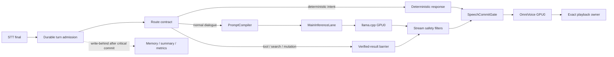
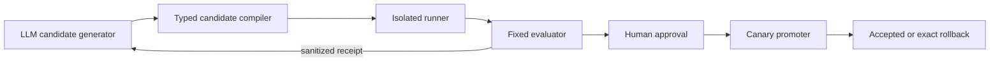

---
tags:
  - evelyn
  - llm
  - latency
  - target-architecture
type: target-architecture
status: source-implemented-live-validation-pending
last_reviewed: 2026-08-25
---

# Main LLM Low-Latency Target Architecture

## 1. 문서의 지위와 목표

이 문서는 Evelyn의 Main LLM 첫 응답 지연을 임시 우회가 아니라 구조적으로
줄이기 위한 최종 목표 설계다. 구현 사실은 2026-08-25 source checkpoint와
`현재와 목표의 구분`에만 기록하며, 나머지 `목표`, `후보`, `단계`는 코드·테스트·
통제된 live 검증을 통과하기 전까지 구현된 사실로 보고하지 않는다.

최적화의 제품 지표는 개별 LLM 속도가 아니라 다음 전체 경로다.

```text
STT final
  -> accepted turn의 durable admission
  -> route/context/prompt 준비
  -> Main queue + prompt prefill + raw first token
  -> 안전한 발화 prefix commit
  -> OmniVoice first PCM
  -> exact playback owner의 first write
```

STT 추론 시간은 `post-STT` 지표에서 제외한다. 다만 실제 STT 모델의 GPU 상주와
직전 STT 실행이 Main/TTS에 주는 간섭은 현실적 부하 조건에 포함한다.

## 2. 설계 원칙

1. **전체 SLO 우선**: Main, TTS 또는 한 GPU의 단독 benchmark가 아니라 검증된 첫
   답변 PCM과 실제 playback까지 최적화한다.
2. **원인 분리 후 변경**: 계측되지 않은 구간을 추측으로 재작성하지 않는다.
3. **정확성은 지연 예산 밖으로 밀지 않는다**: durable ingress, memory deletion
   exposure, tool/evidence 검증, stream safety와 cancellation owner를 보존한다.
4. **가짜 선응답 금지**: filler, speculative acknowledgement와 아직 검증되지 않은
   tool 진행 문장은 answer latency에 포함하지 않는다.
5. **GPU에는 큰 연산을, CPU에는 제어를**: model weight, KV cache, attention,
   synthesis tensor는 GPU에 유지하되 tokenization, network, scheduling, 최종 PCM
   전달처럼 작고 불가피한 CPU 제어는 제거 대상으로 보지 않는다. GPU↔CPU의 큰
   tensor 왕복과 동기화 stall을 제거한다.
6. **최소한의 최종 구조**: 새 message bus, DB, dashboard 또는 microservice를
   계측 근거 없이 추가하지 않는다. 논리적 owner는 분명히 하되 기존 Bot API
   process 안에서 안전하게 소유할 수 있으면 그대로 둔다.
7. **LLM은 후보를 제안하고 고정 하네스가 판정**: 후보 생성자는 evaluator,
   authority, safety policy 또는 production promotion 코드를 수정할 수 없다.

여기서 `최적`은 고정된 model/hardware/corpus/allowlist 안에서 safety, quality와
resource gate를 모두 통과한 Pareto 최적값을 뜻한다. 탐색하지 않은 전역 공간의 절대
최적값이라고 과장하지 않으며, search domain과 증거를 함께 versioning한다.

## 3. 현재 검증된 기준선

2026-08-25 report의 1 cold + 3 discard + 10 warm measured 결과다. microphone,
STT elapsed, Control Page proxy, Discord와 speaker는 포함하지 않았다.

| 구간 | warm p50 | warm p95 |
|---|---:|---:|
| Bot 요청 -> 첫 safe delta | 589.5 ms | 688.9 ms |
| Bot 요청 -> 첫 문장 | 637.7 ms | 732.4 ms |
| 첫 문장 -> TTS first PCM | 193.3 ms | 215.4 ms |
| Bot 요청 -> TTS first PCM | 818.2 ms | 947.9 ms |

- cold request -> first PCM은 `1,717.0 ms`였다.
- first safe delta -> first sentence는 표본에서 약 `38~51 ms`, 평균 약
  `45.1 ms`였다.
- 따라서 현재 first-sentence 지연의 약 92%는 첫 safe delta 이전이다.
- 현 report는 ingress, planning/context, Main HTTP queue, prompt-cache hit/prefill,
  raw first token과 두 stream filter를 각각 분리하지 않는다. `589.5 ms`를 순수
  Gemma inference 시간이라고 단정할 수 없다.
- p95는 measured 10개뿐인 진단값이다. 승격 판정용 충분한 표본이 아니다.

근거 report:
`runtime_artifacts/validation/post_stt_latency/report-flashinfer-12step-gpu0-cu129.json`

## 4. 최종 SLO와 품질 gate

다음은 구현 완료를 판정할 목표이지 현재 달성값이 아니다.

| 지표 | p50 목표 | p95 목표 | 추가 조건 |
|---|---:|---:|---|
| post-STT -> Main request write | <=70 ms | <=100 ms | durable admission과 route/context 포함 |
| Main request -> raw first token | <=250 ms | <=350 ms | server queue 포함/분리 모두 기록 |
| raw token -> safe speech commit | <=50 ms | <=80 ms | unsafe prefix 0 |
| post-STT -> safe answer prefix commit | <=400 ms | <=500 ms | filler 제외 |
| safe speech commit -> TTS first PCM | <=200 ms | <=220 ms | reference 품질 비열등 |
| warm post-STT answer first PCM | <=600 ms | <=750 ms | p99 <=900 ms |
| playback first write | - | <=800 ms | 승인된 live speaker/Discord 측정만 |

운영 안정성 gate:

- 1,000-turn soak에서 OOM, malformed stream, duplicate/stale speech가 모두 0이다.
- 각 GPU의 정상 profile에서 최소 4 GiB VRAM reserve를 남긴다.
- 첫 발화가 시작된 turn을 자동 재실행하지 않는다.
- `ack PCM`과 `answer PCM`을 별도 metric으로 기록한다. filler는 answer SLO를
  만족시키지 않는다.
- Main과 TTS의 warmup/cache proof가 끝나기 전에는 `voiceReady`를 열지 않는다.
  그러므로 사용자가 처음 admission된 turn부터 warm SLO를 적용한다.
- cold/cache-miss는 숨기지 않고 별도 lab SLO `answer first PCM p95 <=1,200 ms`로
  관리한다. process start부터 `voiceReady`까지의 startup latency도 별도 보고한다.

## 5. 목표 데이터 흐름



### 5.1 Route contract

각 turn은 발화 전에 다음 중 하나로 분류된다.

| route | 첫 발화 계약 |
|---|---|
| `deterministic` | 이미 확정된 local 결과만 발화한다. cached PCM은 별도 지표다. |
| `direct_dialogue` | Main의 안전하게 commit된 실제 답변 prefix부터 발화한다. |
| `evidence_bound` | search/tool 결과가 fixed verifier를 통과하기 전 model delta를 발화하지 않는다. |
| `mutation_bound` | exact approval과 post-effect receipt 전에는 성공·진행을 발화하지 않는다. |
| `memory_or_vision` | 현재 deletion/exposure와 evidence 계약을 통과한 context만 사용하며 lease가 안전하게 전달되지 않으면 full response를 버퍼링한다. |

Router 자체가 Main보다 비싸거나 불확실한 단순 대화는 existing direct path를 사용한다.
정확한 deterministic intent는 LLM을 호출하지 않는다. 이것은 답변 의미를 줄이는
fallback이 아니라 route 계약에 맞는 최종 경로다.

### 5.2 Durable 경계와 허용되는 overlap

- accepted source turn의 durable claim/commit이 끝나기 전에 Main을 시작하지 않는다.
- admission 뒤의 독립적인 delivery-inflight 기록이나 content-free metric flush는 GPU
  prefill과 겹칠 수 있다. 사용자에게 보이는 첫 event 전에는 해당 route가 요구하는
  durable barrier가 완료되어야 한다.
- barrier 실패는 Main/TTS를 취소하고 fail-closed한다. fsync를 제거하거나 비내구성
  success로 바꾸지 않는다.
- memory summary, optional cognitive work와 일반 write-behind는 first audio critical
  path 밖에서 실행한다.
- ingress의 현재 권위 상태 머신과 receipt를 새 latency 전용 상태로 복제하지 않는다.
  latency marker는 기존 상태 전이의 관측값이며 처리 권한이 아니다.

현재 보존할 code owner:

| 경계 | 현재 owner |
|---|---|
| ingress claim/recovery | `conversation_ingress_recovery.py`, `fast_control_api.py` |
| memory read/deletion exposure | `memory_exposure.py`, `conversation_memory_exposure.py` |
| stream prefix/promise safety | `text.py`, `fast_action_runtime.py` |
| TTS/playback generation owner | `tts_playback.py`, `local_bridge_barge_in.py`, `local_io_bridge.py` |
| warmup/metrics | `llm_warmup_runtime.py`, `observability_metrics.py` |

## 6. 핵심 컴포넌트

### 6.1 `LatencyTrace`

기존 turn-stage/observability 체계를 확장하며 새 telemetry service는 만들지 않는다.
schema는 `evelyn.voice-latency-trace.v1`로 고정한다.

필수 monotonic marker:

```text
turn_accepted
ingress_committed
route_done
context_done
prompt_compiled
main_admission_requested
main_slot_acquired
main_request_written
main_headers_received
raw_first_token
safe_first_delta
speech_prefix_committed
tts_requested
tts_started
tts_first_pcm
playback_first_write
turn_completed
```

필수 server/config field:

- prompt ABI와 config fingerprint
- `prompt_n`, `cache_n`, processed prompt tokens와 prompt time
- Main slot queue time, generation time와 finish reason
- model/image/llama.cpp revision, GPU UUID/driver와 hardware profile
- route, cold/warm/cache-proof 상태, external GPU interference flag

원문, transcript, prompt, 음성 경로와 reference audio는 기록하지 않는다. 길이,
bucket과 content-free fixture ID만 허용한다. 공개 synthetic probe는 고정 fixture ID를
쓰고, private corpus의 prompt/reply hash는 사전 대입 위험 때문에 artifact에 저장하지
않는다. 모든 duration은 같은 process에서는 `monotonic_ns` 차이로 계산하고, process 간
wall clock 합산은 하지 않는다.

### 6.2 `PromptCompiler`와 Prompt ABI

Fast Control, Discord/Core voice와 warmup이 하나의 compiler를 공유한다. 별도 prompt
문자열을 복사해 유지하지 않는다.

```text
model SHA
+ tokenizer SHA
+ chat-template SHA
+ content format/version
+ stable system prefix SHA
+ message ordering/window policy
= promptAbiId
```

canonical 순서:

```text
byte/token-identical system + capability prefix
-> session-static identity/context
-> bounded dialogue prefix
-> 이번 요청에서 실제로 필요한 memory/tool/runtime context
-> current user turn
```

- stable 구간과 dynamic suffix의 token 수/fingerprint를 따로 기록한다.
- history window를 줄이거나 context 위치를 바꾸는 후보는 latency만으로 승격하지 않고
  대화 품질 corpus를 통과해야 한다.
- prompt budget 초과는 deterministic policy로 자르며 turn별 임의 요약을 critical path에
  넣지 않는다.
- 현재 history 8, context 8192, cache reuse 256은 기준선일 뿐 최종값으로 간주하지 않는다.

### 6.3 Warmup과 readiness

현재처럼 첫 streamed delta만 보고 연결을 끊는 warmup을 최종 상태로 인정하지 않는다.

1. production `PromptCompiler`로 실제 stable prefix와 seed suffix를 만든다.
2. `max_tokens=1` probe를 terminal event/`[DONE]`까지 drain한다.
3. 다른 user suffix로 두 번째 probe를 보낸다.
4. `cache_n`, processed prompt tokens, prompt time과 finish reason을 검증한다.
5. Main과 TTS가 모두 exact image/model/profile에서 proof를 통과한 뒤에만
   `voiceReady=true`가 된다.
6. idle cache eviction과 process restart는 별도 cold scenario로 측정한다.

readiness는 process ID, model/image, Prompt ABI, cache proof와 hardware profile에 묶인
epoch다. 하나라도 바뀌거나 cache proof TTL이 만료되면 readiness를 닫는다. 실제 cache
eviction이 관측될 때만 idle foreground-preemptible keeper probe를 도입하며, 근거 없는
주기 polling은 만들지 않는다.

Warmup correctness는 optimizer가 조절하는 knob가 아니라 고정된 readiness 계약이다.

### 6.4 `MainInferenceLane`

Main request의 단일 논리 owner다. 첫 구현에서는 기존 Bot API 안의 typed broker로
유지한다. 별도 process/service는 측정된 isolation 또는 lifecycle 필요가 생길 때만
분리한다.

- production caller는 owner를 거치며 같은 backend slot으로 직접 우회하지 않는다.
- latency-critical voice turn은 한 개의 명시적 realtime lane을 사용한다.
- background validation, summary 또는 batch job은 realtime admission 중 GPU0을 쓰지
  않는다.
- voice capture/admission lease가 열리는 순간 STT final 전에도 foreground reservation을
  세워 새 background Main job의 시작을 막는다. 이미 실행 중인 job은 결과 ambiguity를
  만들며 강제 종료하지 않고, background token/deadline을 원래부터 bounded하게 둔다.
- request는 exact turn/generation/cancellation owner에 결박한다.
- slot queue, request write, first header와 raw token을 각각 계측한다.
- 이미 시작된 외부 effect의 outcome이 ambiguous하면 latency timeout을 이유로 자동
  재시도하지 않는다.

### 6.5 `SpeechCommitGate`

`ModelStreamPrefixFilter`, `SafeIncrementalSpeechFilter`와 발화 chunking을 우회하지
않는다. 목표 순서는 `raw token -> ModelStreamPrefixFilter -> visible/output policy ->
promise/evidence policy -> SpeechChunker candidate -> exposure/delivery SpeechCommitGate ->
TTS`다. Core와 Fast Control이 서로 다른 splitter를 유지하지 않도록 existing
`SpeechChunker`를 공용 owner로 승격한다.

일반 대화의 후보 정책:

- 한국어의 자연스러운 종결·쉼표 경계에서 첫 12~24자를 우선 commit한다.
- 불안정한 어미, code/tag, URL, 아직 뒤집힐 수 있는 주장과 미완성 약속은 보류한다.
- 38자 이내에 안전한 경계가 없으면 글자 수만으로 자르지 않고 다음 안전 경계를
  기다린다.
- committed text는 최종 assistant text의 exact immutable prefix여야 한다.
- tool/search/mutation의 progress와 성공은 fixed evidence barrier 전에는 commit하지
  않는다.

각 commit은 `turn_id + response_generation + prefix_index + prefix_hash`를 가진다.
barge-in이나 replacement가 생기면 exact generation의 TTS/playback만 취소한다.

#### Memory-bound prefix의 특별 경계

현재 memory-bound Local/voice 경로는 deletion/exposure lease 경쟁을 피하려고 LLM
출력을 끝까지 버퍼링한 뒤 같은 guard 아래 TTS를 시작한다. 이 경로를 단순히 첫
phrase TTS로 바꾸면 안 된다.

memory-bound phrase overlap의 목표 계약은 다음 중 하나를 증명하는 것이다.

1. LLM consumer의 exact deletion position, memory version와 note IDs에 묶인 lease를
   delivery worker로 공백 없이 atomic handoff한다.
2. 같은 좌표에만 유효한 bounded shared read lease를 만들고 correction writer,
   cancellation과 crash recovery의 경쟁을 모두 회귀로 고정한다.

둘 중 하나가 구현·검증되기 전에는 memory-bound route의 full-response buffering을
유지한다. lease를 놓았다가 다시 얻는 사이의 공백이나 stale lease 재획득은 허용하지
않는다.

### 6.6 TTS overlap과 GPU-resident 경로

- 첫 speech prefix commit 직후 OmniVoice를 시작하고 Main은 나머지 답변을 계속
  생성한다.
- 한 active synthesis와 최대 한 pending phrase만 허용한다. stale pending phrase는
  시작 전에 버린다.
- reference audio에서 반복 계산 가능한 feature는 profile/model fingerprint에 묶어
  미리 계산하고 GPU-resident cache 후보로 측정한다. 원본 음성이나 경로를 metric에
  기록하지 않는다.
- weight, reference feature, working tensor와 CUDA graph는 GPU에 유지한다. CPU에는
  request metadata와 최종 PCM 전달에 필요한 bounded buffer만 둔다.
- per-step full tensor copy, implicit CPU fallback과 전역 CUDA synchronize는 profiler
  gate에서 실패로 처리한다.

현재 OmniVoice는 실질적으로 phrase 전체 합성 뒤 PCM을 반환한다. blockwise PCM
streaming은 다음을 모두 증명한 뒤에만 승격한다.

- HTTP disconnect가 실제 CUDA generation을 중단한다.
- concurrency slot과 tensor가 bounded하게 회수된다.
- partial PCM 뒤 full fallback이 중복 재생되지 않는다.
- playback generation/owner fence가 유지된다.
- reference 문장 청취 품질과 운율이 비열등하다.

## 7. GPU 및 실행 profile

최우선 controlled A/B 후보는 다음 고정 배치다.

```text
RTX 5090 / realtime answer lane
  - Gemma Main
  - OmniVoice FlashInfer TTS
  - foreground 중 다른 compute 금지

RTX 3090 / ingress and support lane
  - STT
  - Router / Sub
  - Vision / Qwen specialist는 voice foreground lease 중 대기 또는 저우선순위
```

Main과 TTS는 첫 답변 전 대부분 순차이므로 5090 공유가 합리적인 현재 후보다. 반면
STT elapsed를 지표에서 빼더라도 GPU0 상주/직전 실행 간섭은 남으므로 STT를 GPU1로
격리하는 profile을 검증한다.

- runtime이 turn마다 GPU를 옮기지 않는다. model load와 cache invalidation이 더 큰
  지연을 만들 수 있다.
- `realtime_reserved`와 `best_effort` profile을 구분한다. SLO는 전자에만 보장한다.
- CUDA MPS, process 통합, tensor parallel과 dynamic migration은 profiler/A-B가 이득을
  증명할 때만 추가한다.
- profile은 GPU UUID, image/model SHA, VRAM reserve와 concurrency를 exact하게 묶는다.

첫 speech commit부터 TTS first PCM까지는 `first-audio critical section`이다. 이 구간의
Main tail 동시 decode, cooperative yield 가능 backend와 split-GPU TTS profile을 동일
corpus로 비교해 total first-PCM이 가장 짧은 고정 정책을 선택한다. 현재 same-prompt
진단에서는 TTS를 GPU1로 옮겼을 때 TTS는 빨라지지 않고 전체 평균이 약 21 ms
악화됐으므로 split-GPU를 기본값으로 추정하지 않는다.

CPU를 완전히 제거하는 것은 목표가 아니다. HTTP, tokenization, sampler control,
serialization과 playback I/O에는 CPU가 필요하다. 목표는 **bulk model state와 반복 tensor
연산이 CPU를 경유하지 않고, 불가피한 작은 전송이 비동기·bounded인 것**이다.

## 8. Benchmark와 평가 계약

### 8.1 Scenario matrix

| scenario | 확인 목적 |
|---|---|
| exact repeat | 최대 prompt cache reuse와 steady-state 하한 |
| stable prefix + different suffix | 실제 warmup/cache proof |
| rolling history | window 이동과 session cache invalidation |
| requested memory/tool context | dynamic suffix 비용과 품질 |
| idle/cache eviction | warm readiness의 시간 안정성 |
| cold process restart | startup와 cache seed 비용 |
| realistic STT residency | post-STT timer 밖 GPU 간섭 |
| Router/Sub/Vision coexistence | support lane의 foreground 방해 여부 |

### 8.2 표본과 실험 방식

- knob 탐색: condition당 warm measured 최소 30, cold restart 최소 5.
- finalist: 200 warm corpus, 30 restart/idle cases, 1,000-turn soak.
- A/B는 같은 prompt hash/corpus, exact image/model와 ABBA block 순서를 사용한다.
- external GPU utilization을 통제하지 못한 block은 tag하고 승격 판정에서 제외한다.
- p50/p95/p99, bootstrap confidence interval과 effect size를 함께 남긴다.
- current `tools/post_stt_latency_benchmark.py`의 privacy-safe hash/length 방식을
  유지하고 `tools/gpu1_latency_benchmark.py`의 prompt/cache timing parser를 재사용한다.
- source test는 live GPU 성능 증거로 보고하지 않는다.

### 8.3 승격 gate

후보는 가중 평균 점수로 판정하지 않는다. `reliability/completeness -> safety ->
quality -> resource -> latency` 순서의 hard gate를 모두 통과해야 하며 앞 gate의 실패를
더 빠른 latency가 상쇄할 수 없다.

- focused contract/regression test와 privacy test 통과
- error, OOM, malformed stream와 stale/duplicate speech 0
- quality/safety corpus 비열등; phrase/model/TTS 변경은 사용자 청취 gate 포함
- performance-only config는 fixed seed에서 baseline response equivalence 100%; 응답이
  달라지면 자동 승격 대상이 아니라 `quality_review_required`
- warm answer first-PCM p95가 기준선보다 최소 5% 개선되거나 목표 SLO 달성
- p50 regression <=2%, cold regression <=10%
- raw first-token과 safe speech p95 중 어느 것도 10% 넘게 악화하지 않음
- 각 GPU VRAM reserve >=4 GiB
- exact config, prompt ABI와 binary/image fingerprint로 재현 가능

통계적으로 불충분한 빠른 run은 진단 자료일 뿐 promotion 증거가 아니다. benchmark
report는 runtime route admission이나 fallback policy를 자동 변경하지 않는다.

## 9. LLM -> Harness -> LLM 최적화 loop

### 9.1 신뢰 경계



LLM이 받는 것은 원문/secret이 없는 aggregate metric, fixed failure code와 diff summary다.
LLM의 출력은 자유 shell이 아니라 `evelyn.latency-candidate.v1` manifest다.

```json
{
  "schema": "evelyn.latency-candidate.v1",
  "baseRevision": "exact-sha",
  "promptAbiId": "exact-id",
  "baselineConfigHash": "exact-hash",
  "harnessEvaluatorHash": "exact-hash",
  "hardwareProfile": "gpu0-main-tts_gpu1-ingress",
  "changes": [
    {"key": "main.cacheReuse", "value": 128}
  ],
  "hypothesis": "content-free bounded text",
  "expectedMetric": "answer_first_pcm_p95"
}
```

candidate ID, sample count/order, command, GPU/port/mount/network, gate와 retry 횟수는
LLM이 정하지 않는다. coordinator가 canonical manifest와 source/image/model/GPU/corpus/
harness identity에서 candidate ID를 만든다. baseline이나 evaluator hash가 바뀐 후보는
stale로 폐기하고 fresh campaign에서 다시 측정한다. LLM 응답이 malformed이거나 반복
후보이면 deterministic enumerator가 남은 allowlist 후보를 선택한다.

### 9.2 자동 실험 allowlist

config-only isolated lane에서 허용할 후보:

| key/profile | 초기 탐색 domain | 추가 gate |
|---|---|---|
| Main batch | `1024, 2048, 4096` | `ubatch <= batch`, VRAM |
| Main ubatch | `512, 1024, 2048` | one-knob screening 우선 |
| cache reuse | `64, 128, 256, 512` | cache proof와 response equivalence |
| cache RAM MiB | `4096, 8192, 12288` | host/GPU resource gate |
| CUDA graph | `0, 1` | profiler와 stability |
| full SWA cache | `0, 1` | 동일 모델 의미, VRAM·cache proof·response equivalence |
| history limit | `4, 6, 8` | evaluation만 자동, quality review 후 승격 |
| context | `6144, 8192` | evaluation만 자동, quality review 후 승격 |
| speech profile | `sentence`, `natural-12-24` | listening gate 필수 |
| hardware profile | predeclared exact enum | owned lab만 자동; production 승인 |

각 key는 enum/range, compatible set, VRAM ceiling과 timeout을 compiler가 검증한다.
한 run은 먼저 one-knob sweep, 그 뒤 finalist 조합만 확인하며 최대 12 candidate로
제한한다.

backend image bakeoff는 일반 config campaign에 섞지 않는다. 미리 검토·pin한 exact
image만 별도 campaign에서 평가하고 source/build identity와 사람 승격을 요구한다.

자동 lane에서 금지할 항목:

- evaluator, harness, authority, approval, audit 또는 rollback code
- arbitrary shell, arbitrary path/file mutation과 host Docker socket
- system prompt 의미, model weight, tokenizer, safety filter
- tool permission, memory/deletion, ingress/continuity contract
- production credential/network와 private transcript/audio
- production promotion 또는 임의의 live external effect

source-code 후보 loop는 별도 staged workspace에서 existing bounded task contract를
사용한다. read/search/diff와 고정 test command만 자동 실행하고, source apply와
production 반영은 exact human approval을 요구한다.

#### 도구 자동 허용 범위

| 범위 | 기본 정책 |
|---|---|
| source/config/health/GPU의 content-free read | 자동 허용 |
| typed allowlist 후보 생성·검증·reject | 자동 허용 |
| fixed coordinator가 소유한 격리 lab container start/stop | bounded campaign 안에서 자동 허용 |
| localhost benchmark와 owned temporary artifact 정리 | bounded campaign 안에서 자동 허용 |
| production Main drain/restart, config pointer 변경 | exact one-use 사람 승인 필요 |
| history/context/concurrency 의미 변경, user traffic canary | exact 사람 승인과 quality gate 필요 |
| 장시간 GPU 예약 또는 다른 사용자 workload와 충돌 | 실행 전 사람 승인 필요 |
| Discord, microphone, Minecraft, external send/effect | latency campaign에서 금지 |
| credential, private memory/audio, 사용자 GPU process 종료 | 금지 |

candidate/LLM container에는 host Docker socket을 주지 않는다. 고정 coordinator만 exact
Compose project와 owner label을 통해 lab lifecycle을 수행하며 자기 label 밖 container나
사용자 GPU process를 정리하지 않는다. 외부 workload 변화는 `environment_drift`로 해당
round를 무효화한다.

### 9.3 상태 머신

```text
idle
 -> snapshot
 -> baseline_running
 -> candidate_ready
 -> candidate_running
 -> evaluating
 -> feedback_ready
 -> proposed
 -> awaiting_approval
 -> staged
 -> canary
 -> accepted | rolled_back
```

- 각 transition은 run ID, base revision, candidate hash와 fixed receipt에 결박한다.
- `failed`와 `cleanup_required`는 approval 이전 runner/evaluator 경계의 terminal state다.
  approval 뒤에는 receipt 없는 failure/cleanup edge를 허용하지 않고 현재 state에서 fail-stop한 뒤
  source-authentic rollback receipt로만 종료한다.
- timeout/cancellation 뒤 외부 effect outcome이 ambiguous하면 같은 candidate를 자동
  재실행하지 않는다.
- cleanup proof가 없으면 `cleanup_required`에서 다음 run을 막는다.
- evaluator failure와 candidate failure를 다른 code로 반환한다. evaluator가 실패한
  결과를 candidate 성능 실패로 학습시키지 않는다.
- LLM은 실패 receipt를 받아 새 후보를 만들 수 있지만 자신의 권한 범위를 넓힐 수
  없다.
- 최대 12개 candidate와 동일 candidate 1회로 제한한다. inconclusive는 자동 재측정하지 않고
  campaign을 종료하며, 새 측정은 fresh run/identity로 시작한다.
- harness/evaluator 변경 제안은 `harness_change_requested`로 campaign을 중단하고 별도
  코드 변경·사람 승인·새 hash의 fresh campaign으로 분리한다.

### 9.4 Promotion과 rollback

- fixed evaluator가 `proposed`를 만들 수는 있지만 production forward promotion은
  항상 사람 승인을 요구한다.
- public coordinator bootstrap에는 runtime observer가 없다. 고정 source-reading observer worker가
  별도로 결박되지 않으면 observation 요청은 `runtime_observer_unavailable`로 fail-close하고
  `awaiting_approval` 이후로 진행하지 않는다.
- exact last-known-good image SHA, Compose/config hash, prompt ABI와 model SHA를
  promotion 전에 보존한다.
- 승인된 canary는 idle boundary에서 적용하고 readiness/cache proof 뒤 traffic을 연다.
- 사전에 승인된 canary policy 안에서 health/OOM/SLO gate가 깨지면 exact
  last-known-good로 자동 rollback하고 다시 warmup한다.
- 이미 partial speech 또는 remote effect가 시작된 turn은 rollback 뒤 자동 재시도하지
  않는다.

## 10. Backend/model 변경의 순서

다음 순서를 건너뛰지 않는다.

1. raw token, queue, cache와 filter 구간 계측
2. Prompt ABI/cache proof와 warmup 정상화
3. GPU realtime lane 격리
4. batch/ubatch/cache/SWA/history의 controlled optimization
5. 그래도 raw first-token p95가 350 ms를 넘으면 동일 모델 backend bakeoff
6. backend로도 SLO를 못 맞출 때만 model/quantization 후보 평가
7. 이후에만 blockwise TTS나 speculative decoding을 평가

동일 모델 backend 후보는 exact build와 feature compatibility를 pin한다. 승격은
first-token p95 15% 이상 또는 first-PCM p95 10% 이상 개선, 동일 품질/안전,
VRAM/soak/startup/cancellation gate를 요구한다.

현재 first delta 이후 sentence까지 약 45 ms뿐이므로 speculative decoding은 첫 원인
후보가 아니다. 작은 모델이 먼저 말하고 Main이 뒤에서 고치는 방식도 음성 prefix를
회수할 수 없어 금지한다. 작은 모델을 쓴다면 품질 gate를 통과한 route의 최종 답변
owner여야 한다.

## 11. 구현 지도

### 2026-08-25 source checkpoint

- `VoiceLatencyTrace`의 18개 content-free marker가 request/turn/durable ingress, route/context/prompt,
  Main admission slot/write/header/raw/safe token, speech commit, TTS request/start/first PCM,
  playback first write와 completion을 잇는다.
- Prompt ABI v2는 model, embedded tokenizer/chat template, canonical prompt wire, llama-server와
  shared-library closure, 실제 argv와 CUDA graph env를 exact identity로 묶는다. warmup은 서로 다른
  두 suffix를 terminal까지 drain하고 second-suffix cache proof, typed timing/finish reason과 backend
  epoch를 요구하며 TTL 전에 proactive refresh한다.
- 별도 `main_llm_gateway`가 모든 production surface의 REALTIME/BACKGROUND priority lane을 소유한다.
  accepted voice turn은 actual first REALTIME Main admission 경계에서 capture generation/backend epoch에
  결박된 one-shot reservation을 활성화하거나 refresh한다.
- Core/Fast/Local은 같은 `SpeechCommitGate`를 사용한다. generation fence와 final-prefix equality를
  통과한 irreversible chunk만 TTS에 넘기고 TTS 준비와 playback을 bounded overlap한다.
- `main_latency_optimizer_loop.py --run-owned-lab`은 allowlisted 숫자 후보를 최대 12회 제안받아
  immutable fixed runner/evaluator receipt를 feedback한다. owned lab은 internal-only network/read-only
  input, immutable image/identity, repeated ABBA, restart→readiness 및 readiness 이후 첫 응답, finalist
  1,000-turn soak, cache/GPU PID/privacy/quality/resource gate를 실행한다.
- POSIX process group/Windows KillOnClose Job, host-wide campaign lock과 startup/terminal all-owner
  stable-zero reconciliation이 timeout/cancel/hard-kill cleanup을 fail-close한다. unknown cleanup은
  `CLEANUP_REQUIRED`다.
- production lifecycle validation은 run-bound external observer receipt와 evaluator/lifecycle capability를
  분리하고, 선택적 SQLite CAS journal로 restart replay와 accepted/rollback fork를 막는다. public
  coordinator에는 observer adapter가 없으므로 자동 loop는 production을 변경하지 않고
  `awaiting_approval`에서 fail-close한다.
- source Compose 기본 역할은 GPU0 Main+TTS, GPU1 STT다. 이후 fixed lab에 exact Compose identity,
  CUDA graph 실제 상태, optional full-SWA와 WDDM pre-run baseline cleanup을 추가했다. live에서 SWA0은
  strict second-suffix cache proof가 0%라 부적격이었고 SWA1은 initial·graph-off strict readiness와 Prompt
  ABI exact까지 통과했다. direct/E2E 호출 계약과 noninitial gateway lifecycle 결함은 회귀로 수정했다.
- legacy CUDA library의 RTX 5090 native cubin 부재와 `sm_52` PTX-only packaging을 first-use JIT tail의
  원인으로 확인했다. 기존 build를 보존한 CUDA 12.9.2 `120a-real` side-by-side build는 `sm_120a` cubin만
  포함하고 PTX가 없도록 검증했다. optional Main-only build selector와 pinned CUDA 12.9.2 runtime을 연결했고
  GPU1 LLM build는 분리했다.
- Fast와 Core/Discord warmup은 production의 canonical system prefix로 기대 Prompt ABI를 계산한다. 실제
  warmup ABI가 다르면 HTTP 전에 닫고 Bot readiness는 cache proof와 production prompt match를 함께 요구한다.
- native graph-off diagnostic은 strict cache `33/33`, validity failure `0`, resident first-PCM p50/p95
  `239.9/292.1ms`, TTFT `38.298/57.301ms`, clean cleanup을 통과해 기존 약 11.3초 tail을 제거했다. 하지만
  이 first-PCM run은 실제 TTS 합성 readiness 정정 전이므로 root-cause 진단에만 쓴다.
- readiness 정정 뒤 native SM120/SWA1 graph-off/on은 둘 다 cache `33/33`, validity failure `0`, clean
  cleanup을 통과했다. graph-on은 graph-off 대비 answer first PCM first-after-warmup/resident p95/idle을
  `314.0/298.7/324.7ms`에서 `294.6/262.6/228.8ms`로 낮췄다. local 기본 설정은 batch/ubatch
  `2048/2048`, cache reuse/RAM `256/8192MiB`, CUDA graph/full-SWA `1/1`, native SM120 Main build다.
  독립 graph-on도 first-after-warmup `278.8ms`, resident p50/p95 `205.8/259.0ms`를 재현했지만 idle은
  `387.8ms`로 변했다. 두 run 모두 fixed resident 5회이므로 30/200 campaign, restart/idle/soak와
  speaker/Discord SLO 승격은 아직 남아 있다.

### Phase 1 — 원인 계측과 readiness 정정 — source/native TTS-ready 진단 완료

- 18-stage trace, strict schema v3 benchmark, terminal-drain/second-suffix cache proof와 backend
  epoch, production Prompt ABI match gate를 구현했다. native SM120 build에서 JIT tail 제거와 strict cache를
  확인했고 corrected TTS readiness의 graph-off/on fixed E2E를 완결했다. broader 분포 검증은 Phase 4에 남긴다.

### Phase 2 — canonical prompt와 realtime GPU lane — local 기본값 선택, broader campaign 대기

- 모든 Main surface와 warmup이 Prompt ABI v2와 global gateway를 사용한다. GPU0 Main+TTS,
  GPU1 STT fixed source profile과 realtime-first reservation을 구현했다. corrected TTS-ready graph A/B와
  SWA0 cache-proof 부적격에 따라 graph-on/full-SWA/native SM120과 ubatch 2048을 local 기본값으로 선택했다.
  launcher/Compose는 exact `120a-real` Main build가 없으면 일반 build로 fallback하지 않고 닫으며 GPU1 LLM은
  기존 multi-architecture build를 쓴다. 30-sample screening과 200-sample finalist, restart/idle/soak는 남아 있다.

### Phase 3 — 공용 speech commit — source 완료, 청취 검증 대기

- Core/Fast/Local streaming 경로를 공용 `SpeechCommitGate`로 수렴시키고 TTS/playback marker와
  bounded overlap을 연결했다. phrase 품질, cancellation/barge-in과 실제 speaker/Discord 청취는
  controlled live 검증을 요구한다.

### Phase 4 — bounded optimizer — source 완료, campaign 실행 대기

- 단일 explicit entrypoint, typed manifest, fixed isolated runner/evaluator, signed aggregate receipt,
  per-leg recreate→readiness→prime→resident lifecycle, process-tree cleanup, campaign fence와 WDDM
  stable-zero proof를 구현했다. production은 observer receipt와
  사람 승인 뒤 canary/accept/rollback만 허용하며 automatic promotion은 없다. SQLite는 선택적
  lifecycle replay journal일 뿐 daemon/dashboard나 runtime memory DB가 아니다. 실제 source-reading
  production observer worker 설치는 campaign 이후 별도 승인 단계다.

### Phase 5 — 필요할 때만 backend/model/TTS 구조 변경

- 앞 단계 뒤에도 SLO가 깨질 때 동일 모델 backend bakeoff를 실행한다.
- model/quantization과 blockwise TTS는 별도 품질·취소·soak 승인을 거친다.

## 12. Definition of Done

다음을 모두 만족해야 이 설계를 완료로 본다.

- 모든 surface가 canonical Prompt ABI, Main owner와 speech commit contract를 사용한다.
- latency trace가 전체 critical path를 content-free하게 분해한다.
- exact production warmup이 cache proof를 완료해야 readiness가 열린다.
- realistic STT residency를 포함한 warm p50/p95/p99가 목표를 만족한다.
- speaker와 Discord live playback first-write가 승인된 검증에서 목표를 만족한다.
- 1,000-turn soak와 cancellation/barge-in/restart fault matrix가 통과한다.
- optimizer가 allowlist 밖 변경, evaluator 변경과 production self-promotion을 거부한다.
- exact last-known-good rollback과 cleanup proof가 검증된다.
- 품질·안전·memory/ingress/continuity 계약에 회귀가 없다.

## 13. 명시적 비목표

- filler나 고정 문구로 체감 지연만 숨기기
- 안전 filter, durable commit 또는 evidence barrier 생략
- turn마다 GPU/model/backend를 동적으로 이동
- 계측 근거 없는 service 분리, message bus, DB 또는 새 agent framework
- LLM이 production harness/evaluator/권한을 스스로 수정·승인
- 작은 모델의 취소 불가능한 speculative 음성을 Main이 사후 수정
- benchmark report를 runtime admission/fallback 정책으로 직접 사용

## 14. 현재와 목표의 구분

| 항목 | 현재 확인 | 목표 |
|---|---|---|
| Main backend | llama.cpp, Gemma 4 12B IQ4_XS, GPU0 | 계측·A/B로 pin한 Main realtime lane |
| TTS | OmniVoice FlashInfer 0.6.15, GPU0, sentence 단위 | 안전한 committed phrase overlap; 필요 시 검증된 blockwise |
| STT placement | source 기본 GPU1 ingress; 새 배치 live 미검증 | controlled A/B로 pin한 ingress lane |
| prompt | 모든 Main surface/warmup의 Prompt ABI v2, server closure/argv identity와 production-prefix match gate 구현 | live Core/Discord startup과 corpus equivalence 확인 |
| warmup | terminal drain + second-suffix cache proof + backend epoch/TTL refresh; TTS-ready graph0/1 모두 cache 33/33 | 30 restart와 장기 idle-eviction 분포 확인 |
| Main build | CUDA 12.9.2 `sm_120a` native-only Main 기본 build, missing/wrong arch fail-close; GPU1 multi-arch 보존 | repeated campaign 뒤 human-approved canary/compatible-build rollback 확인 |
| 측정 | SWA0 cache proof 부적격; graph-on 두 run resident PCM p50/p95 207.7/262.6ms, 205.8/259.0ms. idle 228.8/387.8ms | 200 warm/30 restart/idle-tail/1,000 soak + speaker/Discord first-write |
| optimizer | fixed owned runner/evaluator, bounded LLM feedback, WDDM baseline cleanup와 external-observer validation source 구현; production observer 미설치 | idle-GPU controlled campaign + fixed source observer + exact human-approved canary |

관련 결정과 진행 근거: [[02_DECISIONS]], [[worklog/2026-08-25]],
[[EVELYN_ASSISTANT_TARGET_ARCHITECTURE]], `CURRENT_EVELYN_PIPELINE.md`.
